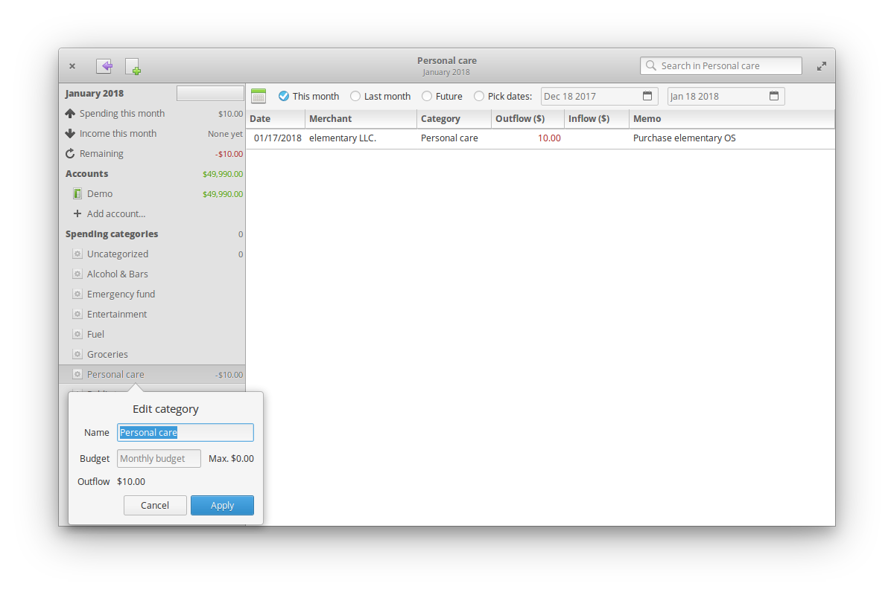

<div>
  <h1 align="center">Envelope</h1>
  <h3 align="center">Personal budget manager</h3>
  <p align="center">Designed for <a href="https://elementary.io"> elementary OS</p>
</div>
<p align="center">
  <a href="https://appcenter.elementary.io/com.github.cjfloss.envelope">
    
  </a>
</p>
<p align="center">
  
</p>

[](https://travis-ci.org/cjfloss/envelope)

## Introduction

Envelope helps you maintain your personal budget by using the tried-and-true [envelope system](https://en.wikipedia.org/wiki/Envelope_system).

Designate spending categories (envelopes) and distribute your monthly income into them.

Configure accounts where you record all your transactions, then assign each of them to a category.

## Features

* Envelope system budget workflow
* Import transactions from QIF/OFX files

## Installation

#### Dependencies
* meson
* ninja
* Vala >=0.23.2
* glib >=2.29.0
* gio-2.0
* Gtk+ >=3.10
* libgee-0.8
* granite-0.3
* sqlheavy-0.1

#### Building from sources
```sh
$ git clone https://github.com/cjfloss/envelope.git
$ cd envelope
$ meson build --prefix=/usr && cd build
$ ninja
```
From there you can either use the binary in `src/com.github.cjfloss.envelope` or install it:
```sh
$ sudo ninja install
```

## Contributing

Want to help? Just fork this repository, pick an issue and start hacking. Just follow the coding style and document your changes.

### Donate
* `Bitcoin: 15zE9cUoe7m2zHjQFCYpHPG7moFB51ncTN`
* `Dash: XhhutrX3rzQDcFY6cFDUdDo9ZDPngrv9Tk`
* `Ethereum: 0xE77D57EA81E1c8Ad394366FfB32A2F556073A147`
* `Monero: 48PJP6rEXdKfAUTHqiBa367taCAuphZiTjgbme99kDvEbkKoPKuN3WMWb2dhraFs3S11oChRasDba2Xth7VbaFke5ZPxbzK`

### Commit messages

Commit messages should follow the [AngularJS commit message conventions](https://docs.google.com/document/d/1QrDFcIiPjSLDn3EL15IJygNPiHORgU1_OOAqWjiDU5Y/edit),
since the changelog is generated from the commit history.
